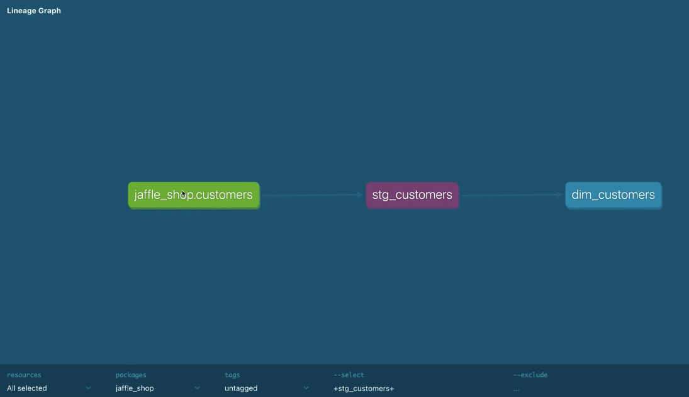

# DBT Overview
## What is DBT?
DBT (Data Build Tool) is an open-source command-line tool that enables data analysts and engineers to transform data in their warehouse more effectively. It allows users to write modular SQL queries, manage dependencies, and automate the transformation process, making it easier to build and maintain data pipelines.
In the modern data stack DBT operates on the layer of the Data Platform e.g. Snowflake, BigQuery, Redshift, etc.
DBT was primarily designed to be used in conjunction with a data warehouse. It is not a data warehouse itself, but rather a tool that helps users transform and manage data within a data warehouse.

<p align="center">
  
</p>

**DBT enables users to:**
- Write modular SQL queries that can be reused across different models in form of select statements
- Manage dependencies between models, ensuring that changes in one model are reflected in others.
- Automate the transformation process, reducing the need for manual intervention.
- Version control SQL code, making it easier to track changes and collaborate with team members and deploy changes to production.
- Document data models and transformations, providing a clear understanding of the data pipeline.
- Test data quality by writing tests to ensure that the data meets certain criteria.
- Schedule and orchestrate data transformations, allowing users to run transformations at specific intervals or trigger them


## DBT Cloud
DBT can be used as a CLI tool, but there is an option to use it as a service with a web interface, which provides features such as collaboration, version control, and scheduling. 
**This service is known as DBT Cloud.**

<p align="center">
  
</p>


## `dbt run` function

When we are invoking `dbt run` we are directly running the SQL code with dependecies between objects.

SQL code is generated based on the **<span style="color:deepskyblue">models</span>**, **<span style="color:greenyellow">sources</span>** and configurations defined in the DBT project. 

When we are looking on the DAG in compiles the dependencies from left to right, 
starting with the **<span style="color:deepskyblue">models</span>** that have no dependencies and ending with the **<span style="color:deepskyblue">models</span>** that depend on other models.

<p align="center">
  
</p>


As we can see there are some dependencies between the **<span style="color:deepskyblue">models</span>**. Let't take a look on dependencies.

## **<span style="color:greenyellow">Sources</span>** and **<span style="color:deepskyblue">Models</span>**

### `source` function

Let's take a look on the `stg_payments` model:

<p align="center">
  
</p>

As we can notice it is build on top of the **<span style="color:greenyellow">source</span>** `stripe.payments`.

We can use this source and build dependency using SQL:
```sql
select * from {{ source('stripe', 'payments') }}
```

### `ref` function
For the objects that inherit from another **<span style="color:deepskyblue">models</span>** we can use the `ref` function:

<p align="center">
  
</p>


```sql
select * from {{ ref('stg_orders') }}
union
select * from {{ ref('stg_payments') }}
```
## Testing and Documentation
DBT provides a way to test the data quality and document the data models.
### Testing
DBT allows users to write tests to ensure that the data meets certain criteria.
For example, we can write a test to check if the `customer_id` column in `stg_customers` model:
- IS NOT NULL
- IS UNIQUE
- HAVE DEPENCENCY WITH `stg_orders` model

To configure tests we can use the `<filename>.yml` file with configuration:
```yaml
version: 2
models:
    - name: stg_customers
      description: This model contains customer data from Stripe
      columns:
            - name: customer_id
              description: Unique identifier for the customer.
              tests:
                - not_null
                - unique
                - relationships:
                    to: ref('stg_orders')
                    field: customer_id
```
Now when we will invoke `dbt test` command, DBT will run the tests and report any issues found in the data.

<p align="center">
  
</p>

### Documentation
DBT allows users to document the data models and transformations, providing a clear understanding of the data.

Using `dbt docs generate` command we can generate the documentation for the DBT project.

<p align="center">
  
</p>

DBT is able to create an entire lineage graph of the data models, showing how the data flows through the transformations.

<p align="center">
  
</p>

Using `dbt docs serve --port 8081` command we can serve the documentation on a local server for given port.

